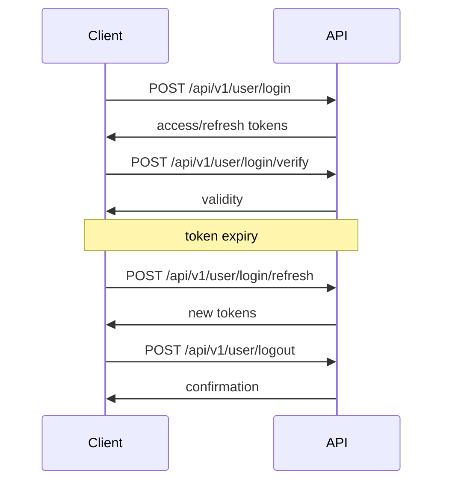

# Authentication

ETHGas API uses Bearer token authentication.

## Overview

Authentication involves:

1. Login – obtain tokens
2. Verify – check token validity
3. Refresh – rotate tokens
4. Logout – invalidate session

## Flow

## API Endpoints

| Method | Endpoint | Description |
|--------|----------|-------------|
| **POST** | `/api/v1/user/login` | Authenticate and obtain access/refresh tokens |
| **POST** | `/api/v1/user/login/verify` | Verify login and complete authentication |
| **POST** | `/api/v1/user/login/refresh` | Refresh expired access tokens |
| **POST** | `/api/v1/user/logout` | Invalidate session and clear tokens |

For copy/paste‑ready HTTP/Python examples, see the detailed API endpoints below.

## Best Practices

- [x] **Store tokens securely** - Keep access tokens in secure storage and never expose them in client-side code
- [x] **Refresh proactively** - Refresh tokens before they expire to maintain continuous access
- [x] **Handle errors gracefully** - Implement proper error handling for authentication failures
- [x] **Logout when done** - Always logout to invalidate sessions and clear tokens 