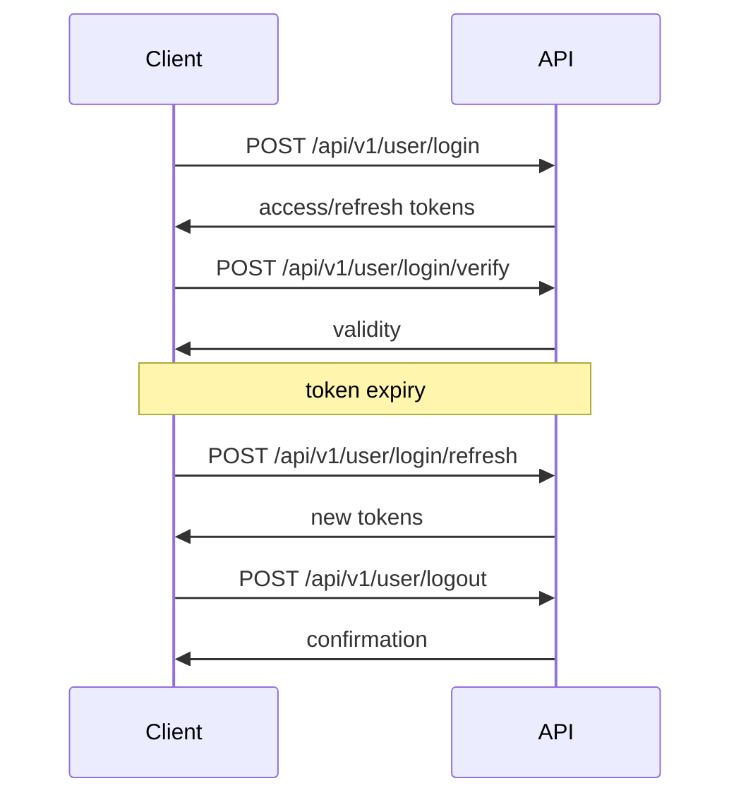

# Authentication

ETHGas API uses Bearer token authentication.

## Overview

Authentication involves:

1. Login – obtain tokens
2. Verify – check token validity
3. Refresh – rotate tokens
4. Logout – invalidate session

## Flow

## Endpoints

- POST `/api/v1/user/login`
- POST `/api/v1/user/login/verify`
- POST `/api/v1/user/login/refresh`
- POST `/api/v1/user/logout`

For copy/paste‑ready HTTP/Python examples, use the official API reference:

- https://developers.ethgas.com/#change-log

## Best Practices

☑️ Store tokens securely
☑️ Refresh proactively
☑️ Handle errors gracefully
☑️ Logout when done 