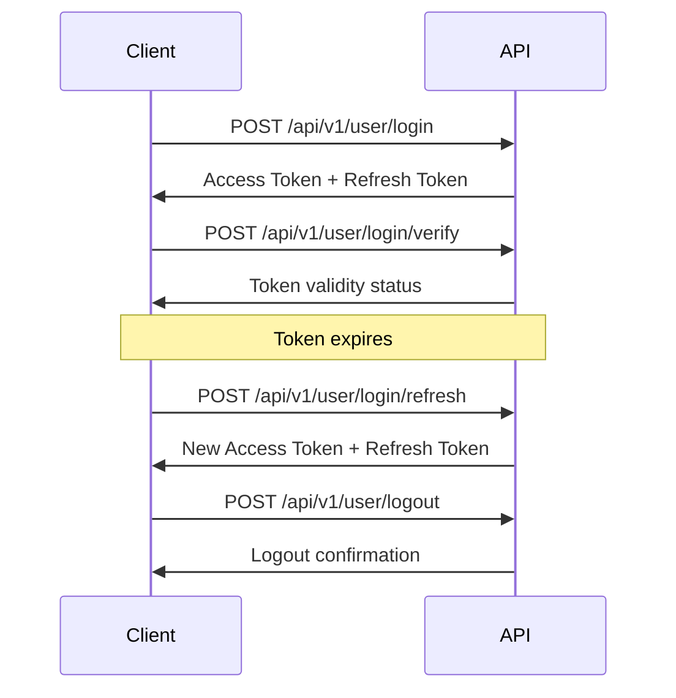

# Authentication

ETHGas API uses token-based authentication for secure access to all endpoints.

## Overview

All API requests require authentication using access tokens obtained through the login process. The authentication flow consists of:

1. **Login** - Obtain access and refresh tokens
2. **Token Verification** - Verify token validity
3. **Token Refresh** - Get new tokens when expired
4. **Logout** - Invalidate tokens

## Authentication Flow



## Endpoints

| Endpoint | Method | Description |
|----------|--------|-------------|
| `/api/v1/user/login` | POST | Authenticate and get tokens |
| `/api/v1/user/login/verify` | POST | Verify token validity |
| `/api/v1/user/login/refresh` | POST | Refresh expired tokens |
| `/api/v1/user/logout` | POST | Logout and invalidate tokens |

## Quick Start

### 1. Login

```bash
curl -X POST "https://api.ethgas.com/api/v1/user/login" \
  -H "Content-Type: application/json" \
  -d '{
    "username": "your_username",
    "password": "your_password"
  }'
```

### 2. Use Access Token

```bash
curl -X GET "https://api.ethgas.com/api/v1/user/info" \
  -H "Authorization: Bearer YOUR_ACCESS_TOKEN"
```

### 3. Refresh Token

```bash
curl -X POST "https://api.ethgas.com/api/v1/user/login/refresh" \
  -H "Content-Type: application/json" \
  -d '{
    "refreshToken": "YOUR_REFRESH_TOKEN"
  }'
```

## Token Management

### Access Tokens
- **Lifetime**: 1 hour (3600 seconds)
- **Usage**: Include in `Authorization` header
- **Format**: `Bearer YOUR_ACCESS_TOKEN`

### Refresh Tokens
- **Lifetime**: 30 days
- **Usage**: Obtain new access tokens
- **Storage**: Secure storage recommended

## Security Best Practices

1. **Store tokens securely** - Use environment variables or secure storage
2. **Refresh proactively** - Refresh tokens before they expire
3. **Handle errors gracefully** - Implement proper error handling
4. **Logout properly** - Always logout when done

## Error Handling

| Error Code | Description | Action |
|------------|-------------|--------|
| 401 | Unauthorized | Re-authenticate or refresh token |
| 403 | Forbidden | Check permissions |
| 429 | Rate Limited | Wait and retry |

## Related Documentation

- [Login](/docs/api/authentication/login) - Initial authentication
- [Verify](/docs/api/authentication/verify) - Token verification
- [Refresh](/docs/api/authentication/refresh) - Token refresh
- [Logout](/docs/api/authentication/logout) - Session termination 