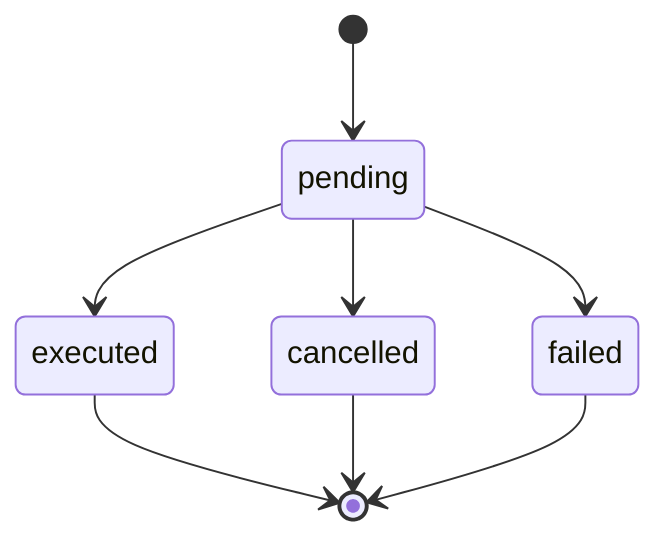

# GET /api/v1/trading/whole-block/get-order

Get details of a specific whole-block trading order.

## Endpoint

```
GET /api/v1/trading/whole-block/get-order
```

## Request Headers

| Header | Value |
|--------|-------|
| Authorization | Bearer YOUR_ACCESS_TOKEN |

## Query Parameters

| Parameter | Type | Required | Description |
|-----------|------|----------|-------------|
| orderId | string | Yes | Unique order identifier |

## Response

### Success Response (200)

```json
{
  "code": 200,
  "message": "OK",
  "data": {
    "orderId": "order_123456",
    "blockNumber": 12345678,
    "status": "executed",
    "createdAt": 1640995200,
    "executedAt": 1640995260,
    "estimatedProfit": "0.5",
    "actualProfit": "0.75",
    "gasUsed": 18000000,
    "gasLimit": 30000000,
    "totalValue": "150.0",
    "baseFee": "20000000000",
    "priorityFee": "1000000000",
    "transactions": [
      {
        "hash": "0x1234567890abcdef1234567890abcdef12345678",
        "from": "0x742d35Cc6634C0532925a3b8D4C9db96C4b4d8b6",
        "to": "0xabcdef1234567890abcdef1234567890abcdef12",
        "value": "1000000000000000000",
        "gasUsed": "21000",
        "gasPrice": "21000000000",
        "priorityFee": "1000000000"
      }
    ],
    "blockHash": "0xabcdef1234567890abcdef1234567890abcdef1234567890abcdef1234567890",
    "slotNumber": 12345678,
    "validatorIndex": 12345,
    "feeRecipient": "0x742d35Cc6634C0532925a3b8D4C9db96C4b4d8b6"
  }
}
```

### Error Response (404)

```json
{
  "code": 404,
  "message": "Order not found",
  "data": null
}
```

## Usage Examples

### cURL

```bash
curl -X GET "https://api.ethgas.com/api/v1/trading/whole-block/get-order?orderId=order_123456" \
  -H "Authorization: Bearer your_access_token"
```

### Python

```python
import requests

def get_order(access_token, order_id):
    url = "https://api.ethgas.com/api/v1/trading/whole-block/get-order"
    headers = {"Authorization": f"Bearer {access_token}"}
    params = {"orderId": order_id}
    
    response = requests.get(url, headers=headers, params=params)
    
    if response.status_code == 200:
        return response.json()["data"]
    else:
        raise Exception(f"Failed to get order: {response.text}")

# Usage
try:
    order = get_order("your_access_token", "order_123456")
    print(f"Order ID: {order['orderId']}")
    print(f"Status: {order['status']}")
    print(f"Profit: {order['actualProfit']} ETH")
    print(f"Gas Used: {order['gasUsed']}")
except Exception as e:
    print(f"Error: {e}")
```

### JavaScript

```javascript
async function getOrder(accessToken, orderId) {
    const response = await fetch(`https://api.ethgas.com/api/v1/trading/whole-block/get-order?orderId=${orderId}`, {
        headers: {
            'Authorization': `Bearer ${accessToken}`
        }
    });

    if (response.ok) {
        const data = await response.json();
        return data.data;
    }
    throw new Error('Failed to get order');
}

// Usage
const accessToken = 'your_access_token';
const orderId = 'order_123456';

getOrder(accessToken, orderId)
    .then(order => {
        console.log('Order ID:', order.orderId);
        console.log('Status:', order.status);
        console.log('Profit:', order.actualProfit, 'ETH');
        console.log('Gas Used:', order.gasUsed);
        console.log('Transactions:', order.transactions.length);
    })
    .catch(error => console.error('Error:', error));
```

## Order Details

### Order Information

| Field | Type | Description |
|-------|------|-------------|
| orderId | string | Unique order identifier |
| blockNumber | integer | Target block number |
| status | string | Order status |
| createdAt | integer | Order creation timestamp |
| executedAt | integer | Order execution timestamp (if executed) |

### Financial Information

| Field | Type | Description |
|-------|------|-------------|
| estimatedProfit | string | Estimated profit when created |
| actualProfit | string | Actual profit after execution |
| totalValue | string | Total value of transactions |
| gasUsed | integer | Gas used by the block |
| gasLimit | integer | Gas limit of the block |

### Fee Information

| Field | Type | Description |
|-------|------|-------------|
| baseFee | string | Base fee per gas |
| priorityFee | string | Priority fee per gas |
| feeRecipient | string | Address receiving fees |

### Block Information

| Field | Type | Description |
|-------|------|-------------|
| blockHash | string | Hash of the executed block |
| slotNumber | integer | Slot number |
| validatorIndex | integer | Validator index |
| transactions | array | Array of transaction details |

## Transaction Details

### Transaction Object

```json
{
  "hash": "0x1234567890abcdef1234567890abcdef12345678",
  "from": "0x742d35Cc6634C0532925a3b8D4C9db96C4b4d8b6",
  "to": "0xabcdef1234567890abcdef1234567890abcdef12",
  "value": "1000000000000000000",
  "gasUsed": "21000",
  "gasPrice": "21000000000",
  "priorityFee": "1000000000"
}
```

### Transaction Fields

| Field | Type | Description |
|-------|------|-------------|
| hash | string | Transaction hash |
| from | string | Sender address |
| to | string | Recipient address |
| value | string | Transaction value in wei |
| gasUsed | string | Gas used by transaction |
| gasPrice | string | Gas price in wei |
| priorityFee | string | Priority fee in wei |

## Order Status Details

### Status Transitions



### Status Descriptions

| Status | Description | Next Possible States |
|--------|-------------|---------------------|
| pending | Order submitted, waiting for execution | executed, cancelled, failed |
| executed | Order successfully executed | (final state) |
| cancelled | Order cancelled by user or system | (final state) |
| failed | Order execution failed | (final state) |

## Error Handling

### Common Errors

| Error Code | Description | Solution |
|------------|-------------|----------|
| 400 | Invalid order ID | Check order ID format |
| 401 | Unauthorized | Check access token |
| 404 | Order not found | Verify order ID |
| 500 | Server Error | Retry request |

### Error Handling Example

```javascript
async function getOrderWithRetry(accessToken, orderId, retries = 3) {
    for (let i = 0; i < retries; i++) {
        try {
            return await getOrder(accessToken, orderId);
        } catch (error) {
            if (i === retries - 1) {
                throw error;
            }
            
            // Wait before retry
            await new Promise(resolve => setTimeout(resolve, 1000 * (i + 1)));
        }
    }
}

// Usage
getOrderWithRetry(accessToken, orderId)
    .then(order => console.log('Order:', order))
    .catch(error => console.error('Failed to get order:', error));
```

## Order Analysis

### Calculate Order Metrics

```javascript
function analyzeOrder(order) {
    const gasEfficiency = order.gasUsed / order.gasLimit;
    const profitPerGas = BigInt(order.actualProfit || 0) / BigInt(order.gasUsed);
    const transactionCount = order.transactions.length;
    
    return {
        gasEfficiency: gasEfficiency,
        profitPerGas: profitPerGas.toString(),
        transactionCount: transactionCount,
        averageGasPerTx: order.gasUsed / transactionCount,
        isProfitable: BigInt(order.actualProfit || 0) > BigInt(0)
    };
}

// Usage
getOrder(accessToken, orderId)
    .then(order => {
        const analysis = analyzeOrder(order);
        console.log('Order Analysis:', analysis);
    })
    .catch(error => console.error('Error:', error));
```

### Compare Orders

```javascript
async function compareOrders(accessToken, orderIds) {
    const orders = await Promise.all(
        orderIds.map(id => getOrder(accessToken, id))
    );
    
    return orders.map(order => ({
        orderId: order.orderId,
        profit: order.actualProfit || order.estimatedProfit,
        gasEfficiency: order.gasUsed / order.gasLimit,
        status: order.status,
        createdAt: new Date(order.createdAt * 1000)
    }));
}

// Usage
const orderIds = ['order_123456', 'order_123457', 'order_123458'];
compareOrders(accessToken, orderIds)
    .then(comparison => {
        console.log('Order Comparison:', comparison);
        
        // Find most profitable order
        const mostProfitable = comparison.reduce((best, current) => 
            parseFloat(current.profit) > parseFloat(best.profit) ? current : best
        );
        console.log('Most profitable:', mostProfitable);
    })
    .catch(error => console.error('Error:', error));
```

## Related Endpoints

- [Place Order](/docs/api/trading/whole-block/place-order) - Submit orders
- [Cancel Order](/docs/api/trading/whole-block/cancel-order) - Cancel orders
- [Get Orders](/docs/api/trading/whole-block/get-orders) - List orders 