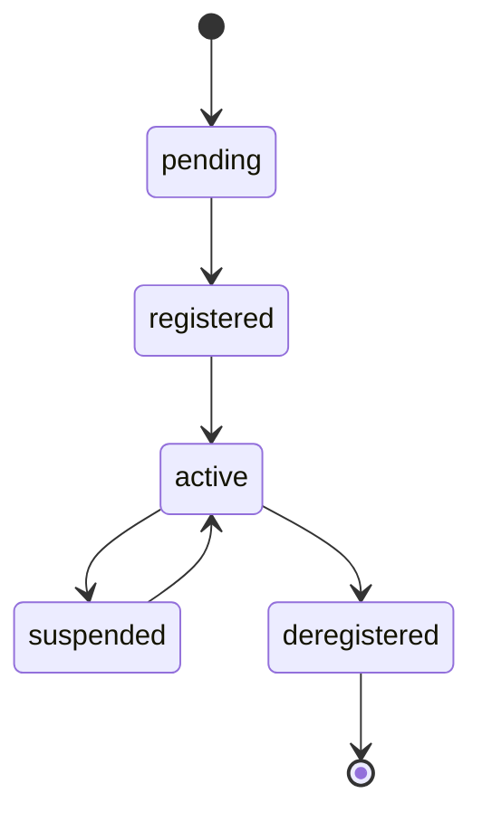

# Standard Validator Registration

Register your validator with ETHGas for enhanced MEV opportunities and rewards.

## Overview

Validator registration with ETHGas enables access to MEV opportunities, enhanced rewards, and platform features. This guide covers the standard registration process for individual validators.

## Prerequisites

Before registering, ensure you have:

1. **Validator Setup Complete** - Follow the [Standard Validator Setup](/docs/validators/setup/standard) guide
2. **ETHGas Account** - Create an account at [ethgas.com](https://ethgas.com)
3. **Validator Keys** - Generated BLS key pairs
4. **Deposit Transaction** - 32 ETH deposited to the deposit contract
5. **API Access** - Valid API credentials

## Registration Process

### 1. Get API Credentials

First, obtain your API credentials from the ETHGas platform:

```bash
# Login to get access token
curl -X POST "https://api.ethgas.com/api/v1/user/login" \
  -H "Content-Type: application/json" \
  -d '{
    "username": "your_username",
    "password": "your_password"
  }'
```

### 2. Register Validator

Register your validator with ETHGas:

```bash
curl -X POST "https://api.ethgas.com/api/v1/validator/register" \
  -H "Authorization: Bearer YOUR_ACCESS_TOKEN" \
  -H "Content-Type: application/json" \
  -d '{
    "validatorPubkey": "0x1234567890abcdef1234567890abcdef1234567890abcdef1234567890abcdef",
    "feeRecipient": "0x742d35Cc6634C0532925a3b8D4C9db96C4b4d8b6",
    "gasLimit": 30000000,
    "builderEnabled": true,
    "mevEnabled": true
  }'
```

### Request Parameters

| Parameter | Type | Required | Description |
|-----------|------|----------|-------------|
| validatorPubkey | string | Yes | Validator public key (0x + 96 chars) |
| feeRecipient | string | Yes | Ethereum address for fee collection |
| gasLimit | integer | No | Block gas limit (default: 30000000) |
| builderEnabled | boolean | No | Enable block building (default: true) |
| mevEnabled | boolean | No | Enable MEV extraction (default: true) |

### Response

#### Success Response (200)

```json
{
  "code": 200,
  "message": "OK",
  "data": {
    "validatorId": "validator_123456",
    "validatorPubkey": "0x1234567890abcdef1234567890abcdef1234567890abcdef1234567890abcdef",
    "status": "registered",
    "registeredAt": 1640995200,
    "feeRecipient": "0x742d35Cc6634C0532925a3b8D4C9db96C4b4d8b6",
    "builderEnabled": true,
    "mevEnabled": true
  }
}
```

#### Error Response (400)

```json
{
  "code": 400,
  "message": "Validator already registered",
  "data": null
}
```

### 3. Verify Registration

Check your validator registration status:

```bash
curl -X GET "https://api.ethgas.com/api/v1/user/validators" \
  -H "Authorization: Bearer YOUR_ACCESS_TOKEN"
```

### 4. Configure Validator Settings

Update validator settings for optimal performance:

```bash
curl -X POST "https://api.ethgas.com/api/v1/validator/settings" \
  -H "Authorization: Bearer YOUR_ACCESS_TOKEN" \
  -H "Content-Type: application/json" \
  -d '{
    "validatorPubkey": "0x1234567890abcdef1234567890abcdef1234567890abcdef1234567890abcdef",
    "settings": {
      "feeRecipient": "0x742d35Cc6634C0532925a3b8D4C9db96C4b4d8b6",
      "gasLimit": 30000000,
      "builderEnabled": true,
      "mevEnabled": true,
      "relaySelection": "auto",
      "maxPriorityFeePerGas": "2000000000",
      "maxFeePerGas": "50000000000"
    }
  }'
```

## Configuration Options

### Fee Recipient Settings

```json
{
  "feeRecipient": "0x742d35Cc6634C0532925a3b8D4C9db96C4b4d8b6",
  "description": "Primary fee collection address"
}
```

### Gas Settings

```json
{
  "gasLimit": 30000000,
  "maxPriorityFeePerGas": "2000000000",
  "maxFeePerGas": "50000000000",
  "description": "Gas configuration for block building"
}
```

### MEV Settings

```json
{
  "builderEnabled": true,
  "mevEnabled": true,
  "relaySelection": "auto",
  "description": "MEV and builder configuration"
}
```

## Registration Status

### Status Codes

| Status | Description |
|--------|-------------|
| pending | Registration submitted, awaiting confirmation |
| registered | Validator successfully registered |
| active | Validator active and participating |
| suspended | Validator temporarily suspended |
| deregistered | Validator deregistered |

### Status Transitions



## API Integration

### Python Example

```python
import requests
import json

class ETHGasValidator:
    def __init__(self, access_token):
        self.access_token = access_token
        self.base_url = "https://api.ethgas.com"
    
    def register_validator(self, validator_pubkey, fee_recipient):
        url = f"{self.base_url}/api/v1/validator/register"
        headers = {
            "Authorization": f"Bearer {self.access_token}",
            "Content-Type": "application/json"
        }
        
        data = {
            "validatorPubkey": validator_pubkey,
            "feeRecipient": fee_recipient,
            "builderEnabled": True,
            "mevEnabled": True
        }
        
        response = requests.post(url, headers=headers, json=data)
        
        if response.status_code == 200:
            return response.json()["data"]
        else:
            raise Exception(f"Registration failed: {response.text}")
    
    def get_validators(self):
        url = f"{self.base_url}/api/v1/user/validators"
        headers = {"Authorization": f"Bearer {self.access_token}"}
        
        response = requests.get(url, headers=headers)
        
        if response.status_code == 200:
            return response.json()["data"]
        else:
            raise Exception(f"Failed to get validators: {response.text}")
    
    def update_settings(self, validator_pubkey, settings):
        url = f"{self.base_url}/api/v1/validator/settings"
        headers = {
            "Authorization": f"Bearer {self.access_token}",
            "Content-Type": "application/json"
        }
        
        data = {
            "validatorPubkey": validator_pubkey,
            "settings": settings
        }
        
        response = requests.post(url, headers=headers, json=data)
        
        if response.status_code == 200:
            return response.json()["data"]
        else:
            raise Exception(f"Settings update failed: {response.text}")

# Usage
client = ETHGasValidator("your_access_token")

# Register validator
result = client.register_validator(
    "0x1234567890abcdef1234567890abcdef1234567890abcdef1234567890abcdef",
    "0x742d35Cc6634C0532925a3b8D4C9db96C4b4d8b6"
)
print(f"Validator registered: {result['validatorId']}")

# Get all validators
validators = client.get_validators()
print(f"Found {len(validators)} validators")

# Update settings
settings = {
    "feeRecipient": "0x742d35Cc6634C0532925a3b8D4C9db96C4b4d8b6",
    "gasLimit": 30000000,
    "builderEnabled": True,
    "mevEnabled": True
}

client.update_settings(
    "0x1234567890abcdef1234567890abcdef1234567890abcdef1234567890abcdef",
    settings
)
```

### JavaScript Example

```javascript
class ETHGasValidator {
    constructor(accessToken) {
        this.accessToken = accessToken;
        this.baseUrl = 'https://api.ethgas.com';
    }
    
    async registerValidator(validatorPubkey, feeRecipient) {
        const response = await fetch(`${this.baseUrl}/api/v1/validator/register`, {
            method: 'POST',
            headers: {
                'Authorization': `Bearer ${this.accessToken}`,
                'Content-Type': 'application/json'
            },
            body: JSON.stringify({
                validatorPubkey,
                feeRecipient,
                builderEnabled: true,
                mevEnabled: true
            })
        });
        
        if (response.ok) {
            const data = await response.json();
            return data.data;
        }
        throw new Error('Registration failed');
    }
    
    async getValidators() {
        const response = await fetch(`${this.baseUrl}/api/v1/user/validators`, {
            headers: {
                'Authorization': `Bearer ${this.accessToken}`
            }
        });
        
        if (response.ok) {
            const data = await response.json();
            return data.data;
        }
        throw new Error('Failed to get validators');
    }
    
    async updateSettings(validatorPubkey, settings) {
        const response = await fetch(`${this.baseUrl}/api/v1/validator/settings`, {
            method: 'POST',
            headers: {
                'Authorization': `Bearer ${this.accessToken}`,
                'Content-Type': 'application/json'
            },
            body: JSON.stringify({
                validatorPubkey,
                settings
            })
        });
        
        if (response.ok) {
            const data = await response.json();
            return data.data;
        }
        throw new Error('Settings update failed');
    }
}

// Usage
const client = new ETHGasValidator('your_access_token');

// Register validator
client.registerValidator(
    '0x1234567890abcdef1234567890abcdef1234567890abcdef1234567890abcdef',
    '0x742d35Cc6634C0532925a3b8D4C9db96C4b4d8b6'
).then(result => {
    console.log('Validator registered:', result.validatorId);
}).catch(error => {
    console.error('Registration failed:', error);
});
```

## Error Handling

### Common Errors

| Error Code | Description | Solution |
|------------|-------------|----------|
| 400 | Invalid parameters | Check request format |
| 401 | Unauthorized | Check access token |
| 403 | Insufficient permissions | Contact support |
| 409 | Already registered | Check existing registration |
| 422 | Validation error | Verify validator data |

### Error Response Format

```json
{
  "code": 400,
  "message": "Invalid validator public key",
  "data": null,
  "errors": [
    {
      "field": "validatorPubkey",
      "message": "Invalid public key format",
      "value": "invalid_key"
    }
  ]
}
```

## Best Practices

### Registration
1. **Verify Keys** - Ensure validator keys are correct
2. **Test First** - Test on testnet before mainnet
3. **Backup Data** - Keep registration data safe
4. **Monitor Status** - Track registration progress

### Configuration
1. **Optimize Settings** - Configure for maximum rewards
2. **Monitor Performance** - Track validator metrics
3. **Update Regularly** - Keep settings current
4. **Document Changes** - Log all configuration changes

### Security
1. **Secure Keys** - Protect validator keys
2. **Monitor Access** - Track API usage
3. **Use HTTPS** - Always use secure connections
4. **Validate Input** - Check all data before sending

## Related Documentation

- [Standard Validator Setup](/docs/validators/setup/standard) - Setup guide
- [Validator Monitoring](/docs/validators/monitoring) - Monitor performance
- [Validator Fees](/docs/api/validator/fees) - Fee management
- [ETHGas API](/docs/api/overview) - API documentation 