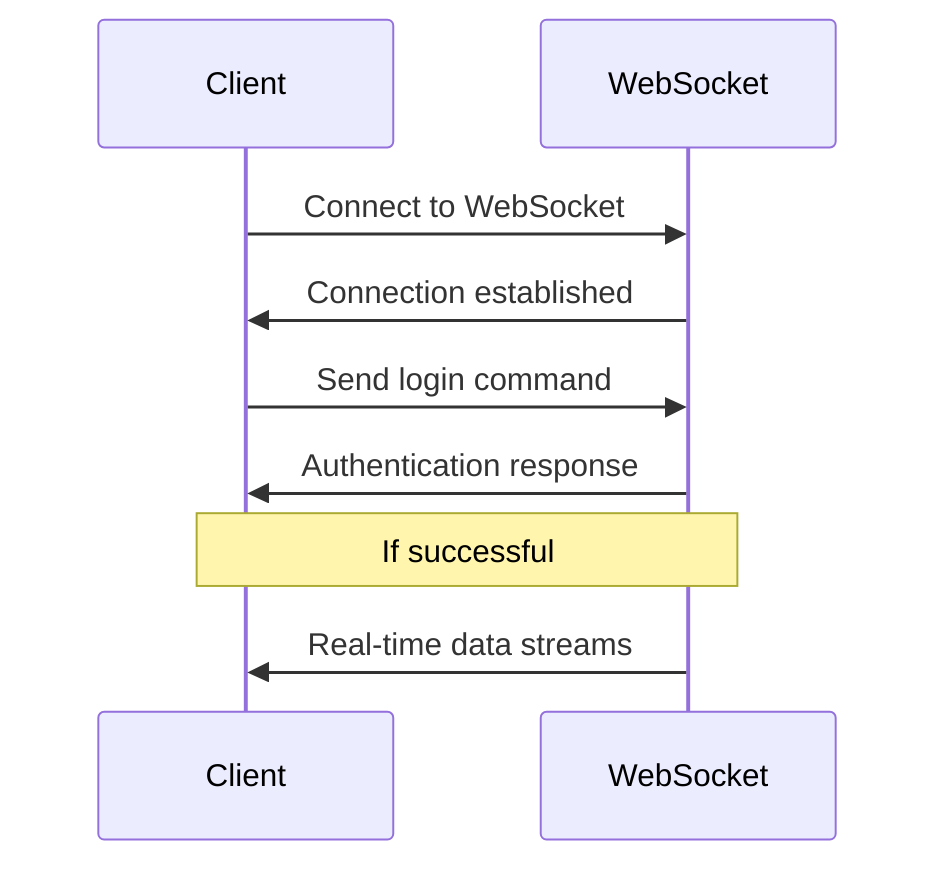

# WebSocket Authentication

Authenticate with the ETHGas WebSocket API for secure real-time data access.

## Overview

WebSocket connections require authentication using access tokens obtained through the REST API. This ensures secure access to real-time market data and private account updates.

## Authentication Flow



## Connection

### Connect to WebSocket

```javascript
const ws = new WebSocket('wss://ws.ethgas.com');
```

### TestNet Connection

```javascript
const ws = new WebSocket('wss://testnet-ws.ethgas.com');
```

## Authentication

### Login Command

Send authentication command after connection:

```javascript
ws.onopen = function() {
    // Authenticate with access token
    ws.send(JSON.stringify({
        cmd: 'login',
        data: {
            accessToken: 'your_access_token_here'
        }
    }));
};
```

### Authentication Response

#### Success Response

```json
{
    "cmd": "login",
    "status": "success",
    "data": {
        "userId": "user_123",
        "username": "john_doe",
        "permissions": ["market_data", "account_updates", "trading"]
    }
}
```

#### Error Response

```json
{
    "cmd": "login",
    "status": "error",
    "error": {
        "code": 401,
        "message": "Invalid access token"
    }
}
```

## Authentication States

### Unauthenticated
- Can only access public market data
- Limited to basic endpoints
- No private data access

### Authenticated
- Full access to all data streams
- Private account updates
- Trading notifications
- Real-time order updates

## Re-authentication

### Token Expiration
When your access token expires, you'll receive a token expiration event:

```json
{
    "cmd": "token_expired",
    "data": {
        "message": "Access token has expired"
    }
}
```

### Re-authenticate
Send a new login command with a fresh token:

```javascript
ws.onmessage = function(event) {
    const data = JSON.parse(event.data);
    
    if (data.cmd === 'token_expired') {
        // Re-authenticate with new token
        ws.send(JSON.stringify({
            cmd: 'login',
            data: {
                accessToken: 'new_access_token_here'
            }
        }));
    }
};
```

## Error Handling

### Connection Errors

```javascript
ws.onerror = function(error) {
    console.error('WebSocket error:', error);
    // Implement reconnection logic
};

ws.onclose = function(event) {
    console.log('WebSocket closed:', event.code, event.reason);
    // Implement reconnection logic
};
```

### Authentication Errors

| Error Code | Description | Solution |
|------------|-------------|----------|
| 401 | Invalid token | Refresh access token |
| 403 | Insufficient permissions | Check account permissions |
| 429 | Rate limited | Wait before retrying |

## Security Best Practices

### Token Management
1. **Store Securely** - Use secure storage for tokens
2. **Refresh Proactively** - Refresh tokens before expiration
3. **Handle Expiration** - Implement automatic re-authentication
4. **Validate Tokens** - Verify token validity before use

### Connection Security
1. **Use WSS** - Always use secure WebSocket connections
2. **Validate Certificates** - Verify SSL certificates
3. **Monitor Connections** - Track connection health
4. **Implement Reconnection** - Handle connection drops

## Implementation Examples

### Python

```python
import websocket
import json
import threading

class ETHGasWebSocket:
    def __init__(self, access_token):
        self.access_token = access_token
        self.ws = None
        
    def connect(self):
        self.ws = websocket.WebSocketApp(
            "wss://ws.ethgas.com",
            on_open=self.on_open,
            on_message=self.on_message,
            on_error=self.on_error,
            on_close=self.on_close
        )
        
        self.ws.run_forever()
    
    def on_open(self, ws):
        print("Connected to WebSocket")
        # Authenticate
        login_message = {
            "cmd": "login",
            "data": {
                "accessToken": self.access_token
            }
        }
        ws.send(json.dumps(login_message))
    
    def on_message(self, ws, message):
        data = json.loads(message)
        print(f"Received: {data}")
        
        if data.get("cmd") == "token_expired":
            # Re-authenticate with new token
            self.reauthenticate()
    
    def on_error(self, ws, error):
        print(f"WebSocket error: {error}")
    
    def on_close(self, ws, close_status_code, close_msg):
        print("WebSocket connection closed")
    
    def reauthenticate(self):
        # Get new token and re-authenticate
        new_token = self.get_new_token()
        login_message = {
            "cmd": "login",
            "data": {
                "accessToken": new_token
            }
        }
        self.ws.send(json.dumps(login_message))

# Usage
client = ETHGasWebSocket("your_access_token")
client.connect()
```

### JavaScript

```javascript
class ETHGasWebSocket {
    constructor(accessToken) {
        this.accessToken = accessToken;
        this.ws = null;
        this.reconnectAttempts = 0;
        this.maxReconnectAttempts = 5;
    }
    
    connect() {
        this.ws = new WebSocket('wss://ws.ethgas.com');
        
        this.ws.onopen = () => {
            console.log('Connected to WebSocket');
            this.authenticate();
        };
        
        this.ws.onmessage = (event) => {
            const data = JSON.parse(event.data);
            this.handleMessage(data);
        };
        
        this.ws.onerror = (error) => {
            console.error('WebSocket error:', error);
        };
        
        this.ws.onclose = (event) => {
            console.log('WebSocket closed:', event.code, event.reason);
            this.handleReconnection();
        };
    }
    
    authenticate() {
        const loginMessage = {
            cmd: 'login',
            data: {
                accessToken: this.accessToken
            }
        };
        this.ws.send(JSON.stringify(loginMessage));
    }
    
    handleMessage(data) {
        console.log('Received:', data);
        
        if (data.cmd === 'token_expired') {
            this.reauthenticate();
        }
    }
    
    reauthenticate() {
        // Get new token and re-authenticate
        this.getNewToken().then(newToken => {
            this.accessToken = newToken;
            this.authenticate();
        });
    }
    
    async getNewToken() {
        // Implement token refresh logic
        const response = await fetch('https://api.ethgas.com/api/v1/user/login/refresh', {
            method: 'POST',
            headers: {
                'Content-Type': 'application/json'
            },
            body: JSON.stringify({
                refreshToken: 'your_refresh_token'
            })
        });
        
        const data = await response.json();
        return data.data.accessToken;
    }
    
    handleReconnection() {
        if (this.reconnectAttempts < this.maxReconnectAttempts) {
            this.reconnectAttempts++;
            console.log(`Reconnecting... Attempt ${this.reconnectAttempts}`);
            
            setTimeout(() => {
                this.connect();
            }, 1000 * this.reconnectAttempts);
        } else {
            console.error('Max reconnection attempts reached');
        }
    }
}

// Usage
const client = new ETHGasWebSocket('your_access_token');
client.connect();
```

## Related Documentation

- [WebSocket Overview](/docs/websocket/overview) - WebSocket API overview
- [WebSocket Overview](/docs/websocket/overview) - WebSocket API overview
- [Authentication API](/docs/api/authentication) - REST authentication 