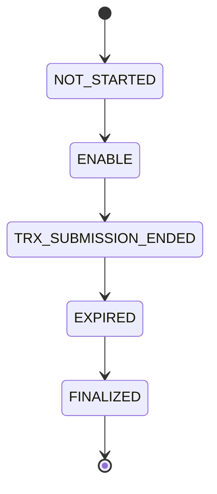

# Preconf Market Update

Real-time updates for inclusion preconfirmation markets via WebSocket.

## Overview

The Preconf Market Update channel provides real-time updates for inclusion preconfirmation markets, including price changes, volume updates, and market status changes.

## Channel Subscription

### Subscribe to Market Updates

```javascript
const ws = new WebSocket('wss://ws.ethgas.com');

ws.onopen = function() {
    // Subscribe to preconf market updates
    ws.send(JSON.stringify({
        cmd: 'subscribe',
        channel: 'preconf_market_update',
        data: {
            market: 'ETH-USD' // Optional: specific market
        }
    }));
};
```

### Subscribe to All Markets

```javascript
ws.send(JSON.stringify({
    cmd: 'subscribe',
    channel: 'preconf_market_update'
}));
```

## Message Format

### Market Update Message

```json
{
    "cmd": "preconf_market_update",
    "data": {
        "market": "ETH-USD",
        "marketId": 1,
        "status": 1,
        "currentPrice": "2000.50",
        "volume24h": "1000.25",
        "high24h": "2100.00",
        "low24h": "1900.00",
        "change24h": "50.00",
        "changePercent24h": "2.5",
        "lastUpdate": 1640995200,
        "expiryTime": 1640998800,
        "slotNumber": 12345678,
        "blockNumber": 12345678
    }
}
```

### Market Status Update

```json
{
    "cmd": "preconf_market_update",
    "data": {
        "market": "ETH-USD",
        "marketId": 1,
        "status": 2,
        "statusText": "EXPIRED",
        "lastUpdate": 1640995200,
        "expiryTime": 1640998800,
        "slotNumber": 12345678,
        "blockNumber": 12345678
    }
}
```

## Data Fields

### Market Information

| Field | Type | Description |
|-------|------|-------------|
| market | string | Market symbol (e.g., "ETH-USD") |
| marketId | integer | Unique market identifier |
| status | integer | Market status code |
| statusText | string | Human-readable status |

### Price Information

| Field | Type | Description |
|-------|------|-------------|
| currentPrice | string | Current market price |
| volume24h | string | 24-hour trading volume |
| high24h | string | 24-hour high price |
| low24h | string | 24-hour low price |
| change24h | string | 24-hour price change |
| changePercent24h | string | 24-hour price change percentage |

### Timing Information

| Field | Type | Description |
|-------|------|-------------|
| lastUpdate | integer | Last update timestamp |
| expiryTime | integer | Market expiry timestamp |
| slotNumber | integer | Current slot number |
| blockNumber | integer | Current block number |

## Market Status Codes

| Status Code | Status | Description |
|-------------|--------|-------------|
| 0 | NOT_STARTED | Market not yet started |
| 1 | ENABLE | Market active and trading |
| 2 | EXPIRED | Market has expired |
| 3 | TRX_SUBMISSION_ENDED | Transaction submission ended |
| 4 | FINALIZED | Market finalized |

## Usage Examples

### Python

```python
import websocket
import json
import threading

class ETHGasWebSocket:
    def __init__(self, access_token=None):
        self.access_token = access_token
        self.ws = None
        
    def connect(self):
        self.ws = websocket.WebSocketApp(
            "wss://ws.ethgas.com",
            on_open=self.on_open,
            on_message=self.on_message,
            on_error=self.on_error,
            on_close=self.on_close
        )
        
        self.ws.run_forever()
    
    def on_open(self, ws):
        print("Connected to WebSocket")
        
        # Authenticate if needed
        if self.access_token:
            login_message = {
                "cmd": "login",
                "data": {
                    "accessToken": self.access_token
                }
            }
            ws.send(json.dumps(login_message))
        
        # Subscribe to preconf market updates
        subscribe_message = {
            "cmd": "subscribe",
            "channel": "preconf_market_update",
            "data": {
                "market": "ETH-USD"
            }
        }
        ws.send(json.dumps(subscribe_message))
    
    def on_message(self, ws, message):
        data = json.loads(message)
        
        if data.get("cmd") == "preconf_market_update":
            self.handle_market_update(data["data"])
    
    def handle_market_update(self, market_data):
        market = market_data["market"]
        price = market_data.get("currentPrice")
        status = market_data.get("status")
        
        print(f"Market: {market}")
        print(f"Price: {price}")
        print(f"Status: {status}")
        
        # Process market update
        if status == 1:  # ENABLE
            print(f"Market {market} is active")
        elif status == 2:  # EXPIRED
            print(f"Market {market} has expired")
    
    def on_error(self, ws, error):
        print(f"WebSocket error: {error}")
    
    def on_close(self, ws, close_status_code, close_msg):
        print("WebSocket connection closed")

# Usage
client = ETHGasWebSocket()
client.connect()
```

### JavaScript

```javascript
class ETHGasMarketClient {
    constructor(accessToken = null) {
        this.accessToken = accessToken;
        this.ws = null;
        this.marketData = new Map();
    }
    
    connect() {
        this.ws = new WebSocket('wss://ws.ethgas.com');
        
        this.ws.onopen = () => {
            console.log('Connected to WebSocket');
            
            // Authenticate if needed
            if (this.accessToken) {
                this.authenticate();
            }
            
            // Subscribe to market updates
            this.subscribeToMarketUpdates();
        };
        
        this.ws.onmessage = (event) => {
            const data = JSON.parse(event.data);
            
            if (data.cmd === 'preconf_market_update') {
                this.handleMarketUpdate(data.data);
            }
        };
        
        this.ws.onerror = (error) => {
            console.error('WebSocket error:', error);
        };
        
        this.ws.onclose = (event) => {
            console.log('WebSocket connection closed');
        };
    }
    
    authenticate() {
        const loginMessage = {
            cmd: 'login',
            data: {
                accessToken: this.accessToken
            }
        };
        this.ws.send(JSON.stringify(loginMessage));
    }
    
    subscribeToMarketUpdates(market = null) {
        const subscribeMessage = {
            cmd: 'subscribe',
            channel: 'preconf_market_update'
        };
        
        if (market) {
            subscribeMessage.data = { market };
        }
        
        this.ws.send(JSON.stringify(subscribeMessage));
    }
    
    handleMarketUpdate(marketData) {
        const { market, currentPrice, status, volume24h } = marketData;
        
        // Update local market data
        this.marketData.set(market, marketData);
        
        console.log(`Market: ${market}`);
        console.log(`Price: ${currentPrice}`);
        console.log(`Status: ${status}`);
        console.log(`Volume: ${volume24h}`);
        
        // Emit custom event for other parts of the application
        this.emitMarketUpdate(marketData);
    }
    
    emitMarketUpdate(marketData) {
        // Create custom event
        const event = new CustomEvent('marketUpdate', {
            detail: marketData
        });
        
        // Dispatch event
        window.dispatchEvent(event);
    }
    
    getMarketData(market) {
        return this.marketData.get(market);
    }
    
    getAllMarketData() {
        return Array.from(this.marketData.values());
    }
}

// Usage
const client = new ETHGasMarketClient();

// Listen for market updates
window.addEventListener('marketUpdate', (event) => {
    const marketData = event.detail;
    console.log('Market update received:', marketData);
});

// Connect to WebSocket
client.connect();

// Get market data
const ethMarketData = client.getMarketData('ETH-USD');
console.log('ETH market data:', ethMarketData);
```

## Market Status Handling

### Status Transitions



### Status Handling

```javascript
function handleMarketStatus(status, marketData) {
    switch (status) {
        case 0: // NOT_STARTED
            console.log(`Market ${marketData.market} not yet started`);
            break;
            
        case 1: // ENABLE
            console.log(`Market ${marketData.market} is active`);
            // Enable trading interface
            enableTrading(marketData.market);
            break;
            
        case 2: // EXPIRED
            console.log(`Market ${marketData.market} has expired`);
            // Disable trading interface
            disableTrading(marketData.market);
            break;
            
        case 3: // TRX_SUBMISSION_ENDED
            console.log(`Market ${marketData.market} transaction submission ended`);
            // Show final countdown
            showFinalCountdown(marketData.market);
            break;
            
        case 4: // FINALIZED
            console.log(`Market ${marketData.market} has been finalized`);
            // Show results
            showMarketResults(marketData.market);
            break;
            
        default:
            console.log(`Unknown market status: ${status}`);
    }
}
```

## Error Handling

### Connection Errors

```javascript
ws.onerror = function(error) {
    console.error('WebSocket error:', error);
    // Implement reconnection logic
};

ws.onclose = function(event) {
    console.log('WebSocket closed:', event.code, event.reason);
    // Implement reconnection logic
};
```

### Message Errors

```javascript
ws.onmessage = function(event) {
    try {
        const data = JSON.parse(event.data);
        
        if (data.cmd === 'preconf_market_update') {
            handleMarketUpdate(data.data);
        } else if (data.cmd === 'error') {
            console.error('WebSocket error:', data.error);
        }
    } catch (error) {
        console.error('Failed to parse message:', error);
    }
};
```

## Best Practices

1. **Handle Reconnection** - Implement automatic reconnection
2. **Validate Data** - Always validate incoming data
3. **Monitor Status** - Track market status changes
4. **Error Handling** - Implement proper error handling
5. **Performance** - Process updates efficiently

## Related Documentation

- [WebSocket Overview](/docs/websocket/overview) - WebSocket API overview
- [WebSocket Authentication](/docs/websocket/authentication) - Authentication guide
- [WebSocket Overview](/docs/websocket/overview) - WebSocket API overview 